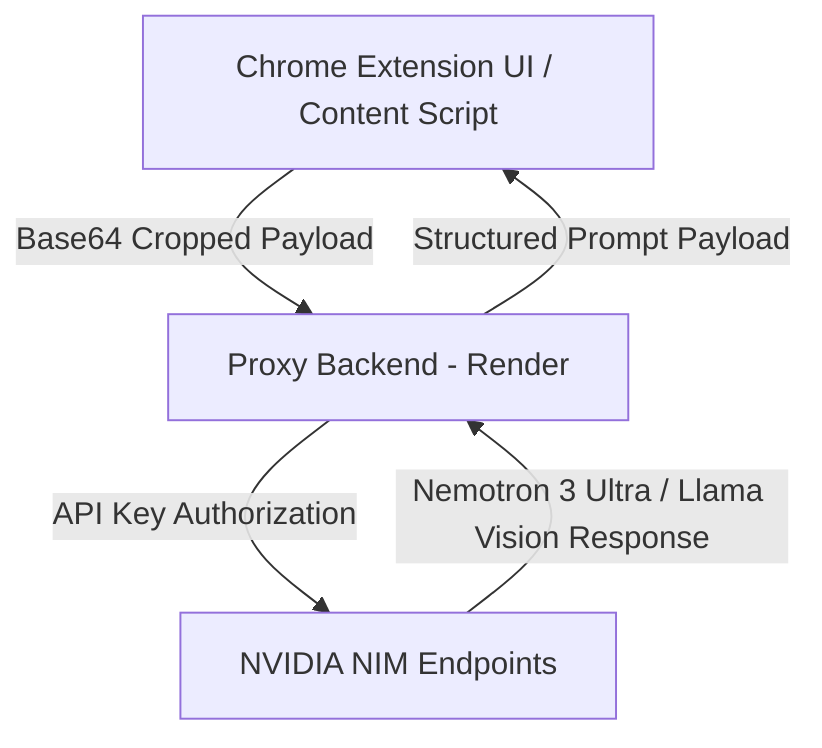

# Cueist AI 🚀
[](https://developer.chrome.com/docs/extensions/mv3/intro/)
[](https://build.nvidia.com/)
[](LICENSE)
[](https://render.com/)
[](https://github.com/Prometheusze/cueist-ai/stargazers)

> **Empower your prompt engineering workflow directly from your browser.**

**Cueist AI** is a futuristic Chrome extension designed to generate high-performing text system prompts and reverse-engineer visual styles from cropped page elements using NVIDIA AI models.

---

## ✨ Features

- **✍️ Craft Perfect Text Prompts:** Transform basic task descriptions into structured, optimized AI prompts powered by NVIDIA Nemotron 3 Ultra.
- **📷 Extract Prompts from Image Crops:** Interactively drag and crop any visual region on an active browser tab to reverse-engineer its visual style, composition, lighting, and color palette using Llama 3.2 Vision.
- **🌌 Futuristic Cyber UI:** Dark cosmic aesthetic featuring animated starfield background, neon highlights, and tab navigation.
- **📋 One-Click Clipboard Actions:** Instant copy controls with inline success confirmations.
- **🔒 Secure Proxy Architecture:** Routes requests through a dedicated backend proxy on Render to protect secret API keys from client-side exposure.

---

## 🏗️ System Architecture

Cueist AI uses a two-tier decoupled architecture to ensure security and cross-origin compatibility:



## 📥 Installation Guide

### Option 1: Developer Mode (Recommended)

1. **Download the Repository:**
   - Click the green **Code** button at the top of this repository and select **Download ZIP** (or clone the repository using `git clone`).
2. **Unpack the ZIP File:**
   - Extract the contents of the downloaded ZIP file to a local folder on your computer.
3. **Open Chrome Extensions Page:**
   - Open Google Chrome and navigate to `chrome://extensions/`.
4. **Enable Developer Mode:**
   - Toggle the **Developer mode** switch located in the top-right corner.
5. **Load Unpacked Extension:**
   - Click the **Load unpacked** button in the top-left corner.
   - Select the extracted `cueist-extension` directory.
6. **Pin & Launch:**
   - Click the Extension puzzle icon in Chrome and pin **Cueist AI** to your toolbar!

---

## 🚀 How to Use

### 1. Generating Text System Prompts
1. Open the **Cueist AI** extension popup from your Chrome toolbar.
2. Click **Craft Perfect Text Prompt**.
3. Type your task description (e.g., *"Write a cold email sequence for a B2B web design agency"*).
4. Click **Generate Perfect Prompt**.
5. Click the **Clipboard icon** to copy the generated prompt to your clipboard.

### 2. Reverse-Engineering Image Styles
1. Navigate to any website containing an image or graphic (e.g., Unsplash, GitHub, Pinterest).
2. Open **Cueist AI** and select **Extract Prompt from Image**.
3. Click **Scan Active Screen**. The extension popup will close, and an interactive dark overlay will appear on your page.
4. **Click and drag your mouse** over the exact visual element you wish to analyze.
5. Upon releasing the mouse, Cueist AI analyzes the cropped selection and presents a floating prompt card in the top-right corner with a one-click copy button.

---

## 📂 Repository Structure

```text
cueist-extension/
├── manifest.json        # Extension Manifest V3 configuration
├── popup.html           # Main extension UI markup
├── popup.js             # UI state navigation & API dispatcher
├── background.js        # Background service worker & tab capture controller
├── content.js           # Page overlay renderer & mouse cropping handler
├── icon.png             # Extension brand asset
└── README.md            # Repository documentation
```

---

## 🛠️ Security & Privacy

- **Zero Data Logging:** Cueist AI does not log, store, or track user interaction history or captured browser images.
- **Client-Side Image Processing:** Screen region cropping happens locally in browser memory via HTML5 Canvas before sending compressed payloads to the backend proxy.
- **Secure Key Storage:** Private NVIDIA API credentials remain stored in Render server environment variables and are never bundled into client-side JavaScript.

## 📜 License

Distributed under the **MIT License**. See `LICENSE` for more information.
